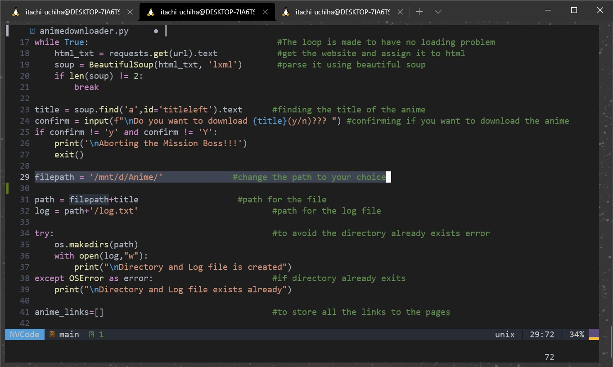

# Anime_downloader

## To effortlessly download anime episodes of a season using a simple python webscrapping.

Few things that you will need to do before using it is:
*install BeautifulSoup
*install requests
\*install requests_html

Now since we have done that lets see what more we are to do;
First thing I you would have to do is set a download path for your file in the animedownloader.py file

